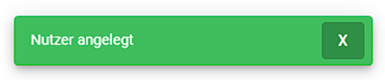

# web-based-database-manager

The web based database manager is a project within my education. Our group consisted of 4 people. We received various [requirements](https://github.com/miwied/web-based-database-manager/blob/develop/documentation/project%20requirements/english/010-requirements-en.md) and were then able to develop our own solution for it. The idea was to create a website for a sports club where users can log in and manipulate the existing data conveniently with the help of a clearly arranged table. For this we have received a fake [database](https://github.com/miwied/web-based-database-manager/blob/develop/docker/db-init/2021sportverein.sql) with already 120 existing members.

## project architecture

 
The **frontend** consists of an Angular application made up of material design components. Node.js includes the node package manager (NPM), which installs and provides the necessary packages for the application. 
The **backend** (implemented in vanilla php) gets the data directly from the database (MariaDB) which is split into structured objects using PDO (library for database access), the respective objects are then encoded into JSON format and communicated to the frontend using an HTTP API upon a corresponding request.

## features

- User registration with secure password storage (hashed, salted and peppered password)
- A session using a json web token is established when you are successfully logged in
- Useful notifications for certain events
- The member data is read from the database and displayed clearly in table form
- Easy to use filter bubbles with the possibility to search for specific texts
- Edit, create and delete mitglideren
- Creation of teams and sports possible
- The input of incorrect data is prevented the user receives a appropriate feedback

## task distribution

#### frontend:

[**Gunzli02**](https://github.com/Gunzli02) 
Implementation of the design of login and main page, as well as styling of elements such as header and footer.

[**GodlesZ95**](https://github.com/GodlesZ95) 
Authentication, communication of components, creation and logic implementations of services, login, models and partial component building, as well as their logic implementation

#### backend:

[**Noodle693**](https://github.com/Noodle693) 
Basic backend architecture according to MVC pattern, elaboration of database access with PDO, creation and elaboration of repository functions especially for the MemberController (+mapping), JWT generation and alignment, CORS implementation, implementation of base classes and methods (e.g. for http errors), database modification (ON DELETE CASCADE), troubleshooting Docker

[**miwied**](https://github.com/miwied) 
Storage and validation of login data (including password salting, peppering and hashing), connection of login data with the database, implementation of base classes and methods (e.g. for http errors), creation of the Github repo, creation of documentation files (in .md file format), setup of Docker (docker-compose + dockerfiles)

## application images

### login page

 

#### login / register + validation

  
  

#### login data in database

 

---

### table page

 

#### filter bubble

#### add member

#### edit member

#### delete member

---

### notifications

#### member was deleted successfully / user created

  
  

#### user is already created / username or password invalid

  
  

